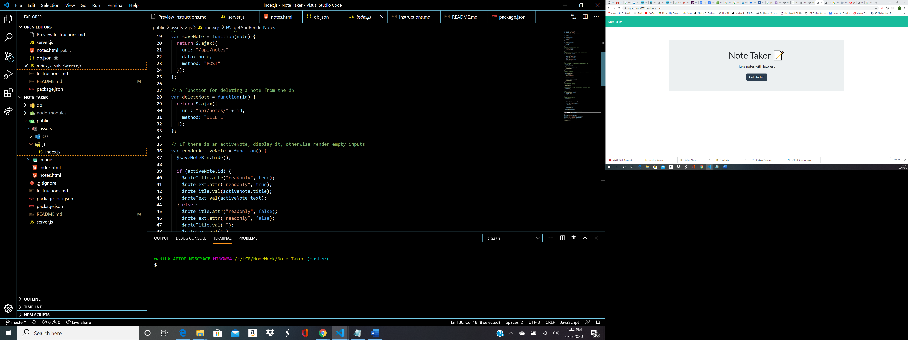

# Note_Taker
Project with Express

Project Title
This is a full Crud application with express.js. Note Taker gives you the opportunity to save edit and delete notes!

Getting Started
You can get a verison of this product up and running through heroku and can see the juicy backend code through the github
page.

Prerequisites
Install
-express

Deployment
Heroku

Try Me Live
<a href="https://mighty-sea-99609.herokuapp.com/">https://mighty-sea-99609.herokuapp.com/</a>

Built With
Express.js
JS
JQuery
CSS3
HTML5
API

Authors
Wadih Ojeil- Full Stack Web Developer

License
This project is licensed under the MIT License
 

## Purpose and Inspiration
This application was designed to test my skills using CRUD and express. Now I can access the site live through heroku and save as many notes as I want.

#### Install and run
Install all the dependencies with NPM
`npm install`  
Then start the project
`node server.js`

